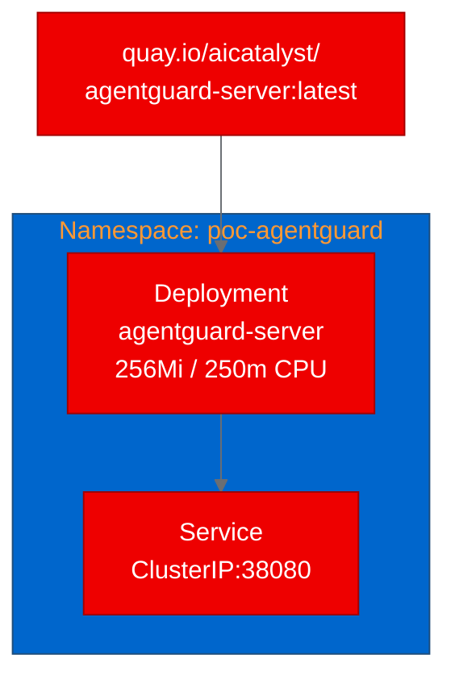

## Securing AI agent tool calls with AgentGuard on OpenShift AI

As AI agents gain the ability to call tools, read files, send emails, and execute code, the question shifts from "can the agent do it?" to "should the agent be allowed to?" AgentGuard answers that question with declarative policy enforcement for LLM-based agents. We deployed it on OpenShift to find out if runtime access control for agents works as a platform service.

## What is AgentGuard?

AgentGuard is an attribute-based access control framework that sits between an LLM planning engine and the tools it invokes. Before each tool call executes, AgentGuard evaluates the request against declarative policies written in a custom DSL. The verdict can be allow, deny, or escalate to a human reviewer.

The framework integrates with LangChain, AutoGen, and OpenAI Agents SDK without modifying the underlying execution logic. It exposes a REST API (FastAPI-based) for remote policy evaluation, making it deployable as a standalone service rather than an embedded library.

## Why this matters for OpenShift AI

Red Hat's AI strategy for 2026 emphasizes management, observability, and security for AI workloads. As agentic AI becomes a core strategy area, the gap between "agents can use tools" and "agents should be governed when using tools" becomes a real platform concern.

AgentGuard fills this gap. It provides:

- **Policy-as-code:** Rules are written in a standalone DSL, versioned, and hot-reloadable
- **Cross-tool chain detection:** Policies can track multi-step attack patterns like "read database, then send email"
- **Audit trails:** Every evaluation decision is logged with the full event context
- **Human-in-the-loop:** Uncertain actions route to human reviewers rather than failing silently

This aligns directly with TrustyAI's guardrails capabilities and extends them into the agentic domain.

## Containerizing for OpenShift

The original project included a Dockerfile using `python:3.11`, but OpenShift requires UBI-based images for compatibility. We created a `Dockerfile.ubi` using `registry.access.redhat.com/ubi9/python-312`:

```dockerfile
FROM registry.access.redhat.com/ubi9/python-312
WORKDIR /opt/app-root/src
COPY pyproject.toml README.md README_CN.md ./
COPY agentguard ./agentguard
COPY rules ./rules
COPY frontend ./frontend
COPY scripts ./scripts
USER 0
RUN pip install --no-cache-dir ".[server]" && \
    chmod +x scripts/entrypoint.sh && \
    chgrp -R 0 /opt/app-root && chmod -R g=u /opt/app-root
EXPOSE 38080
USER 1001
CMD ["agentguard", "serve", "--host", "0.0.0.0", "--port", "38080"]
```

Key adaptations: the `chgrp -R 0` and `chmod -R g=u` commands enable OpenShift's arbitrary UID assignment, and `USER 1001` ensures the container runs as non-root.

## Building and deploying

We used OpenShift's binary build strategy to build the image on-cluster and push to Quay.io:

```bash
oc new-build --name=agentguard-server --binary --strategy=docker \
  --to-docker --to="quay.io/aicatalyst/agentguard-server:latest" \
  --push-secret=autopoc-registry-push
oc start-build agentguard-server --from-dir=. --follow --wait
```

The deployment manifest is straightforward: a single-replica Deployment with readiness and liveness probes hitting the `/health` endpoint, backed by a ClusterIP Service on port 38080.



No GPU, no persistent volumes, no sidecars. The server starts in under 5 seconds and consumes minimal resources.

## Running the PoC tests

We validated four scenarios against the live deployment:

| Test | Result | Latency | What it proved |
|---|---|---|---|
| Health check | PASS | 20ms | Server is up, enforce mode active |
| List rules | PASS | <1ms | Rule management API works (empty, no policy loaded) |
| Evaluate tool call | PASS | <1ms | Policy engine evaluates events and returns decisions |
| Stats endpoint | PASS | <1ms | Observability counters track requests and latency |

The evaluate endpoint returned `action: allow` with `reason: no-rule-matched` for our test event. This is correct behavior: without loaded policies, the default action is allow. In production, you'd mount policy files via ConfigMap to enforce deny and human-check rules.

The stats endpoint confirmed that the evaluation pipeline processes requests with sub-millisecond latency, making it viable for inline enforcement without adding meaningful overhead to agent workflows.

## What we learned

**The build took two attempts.** The first failed because UBI Python images run as UID 1001 by default, and `chgrp` on system-installed packages requires root. The fix was simple: run `pip install` and `chgrp` as `USER 0`, then switch to `USER 1001` for the runtime.

**Image pull secrets matter.** The initial deployment hit `ImagePullBackOff` because the Quay repository defaulted to private. Adding a pull secret to the deployment namespace resolved it.

**GPL-3.0 is the elephant in the room.** AgentGuard's GPL license limits enterprise adoption. The technical capabilities are strong, but any production integration would need legal review for license compatibility.

## Try it yourself

The full deployment artifacts are available in our fork:

- **Fork:** [github.com/aicatalyst-team/AgentGuard](https://github.com/aicatalyst-team/AgentGuard)
- **UBI Dockerfile:** `Dockerfile.ubi`
- **K8s Manifests:** `kubernetes/`
- **Test Script:** `poc_test.py` (on the `autopoc-artifacts` branch)

To deploy on your own OpenShift cluster, clone the fork, build with the UBI Dockerfile, and apply the manifests. Add your own policy rules by mounting a ConfigMap with `.rules` files to the `/opt/app-root/src/rules/` directory.

For teams building agentic AI on Red Hat OpenShift AI, AgentGuard demonstrates that runtime access control can be a lightweight, sub-millisecond platform service rather than embedded glue code in every agent framework.
